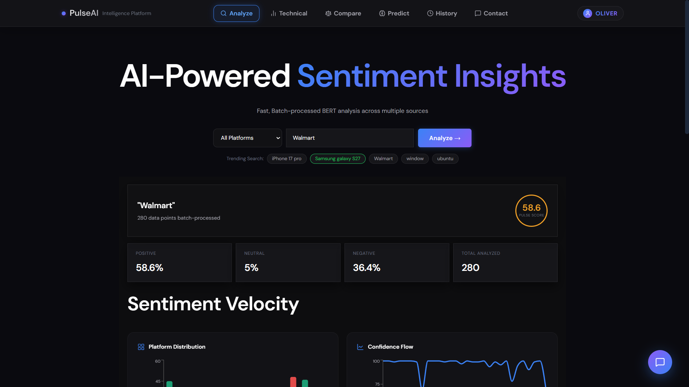
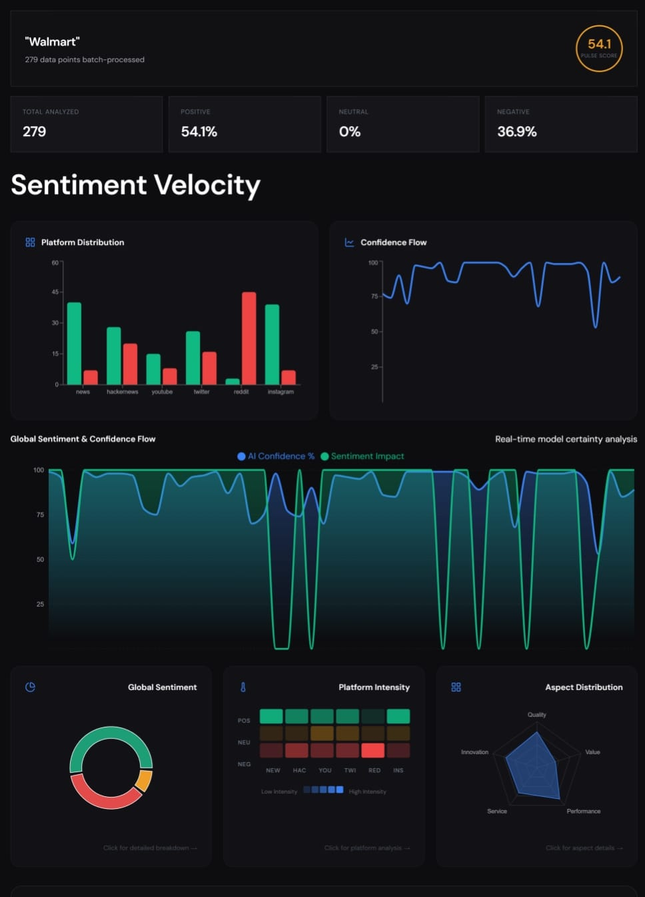
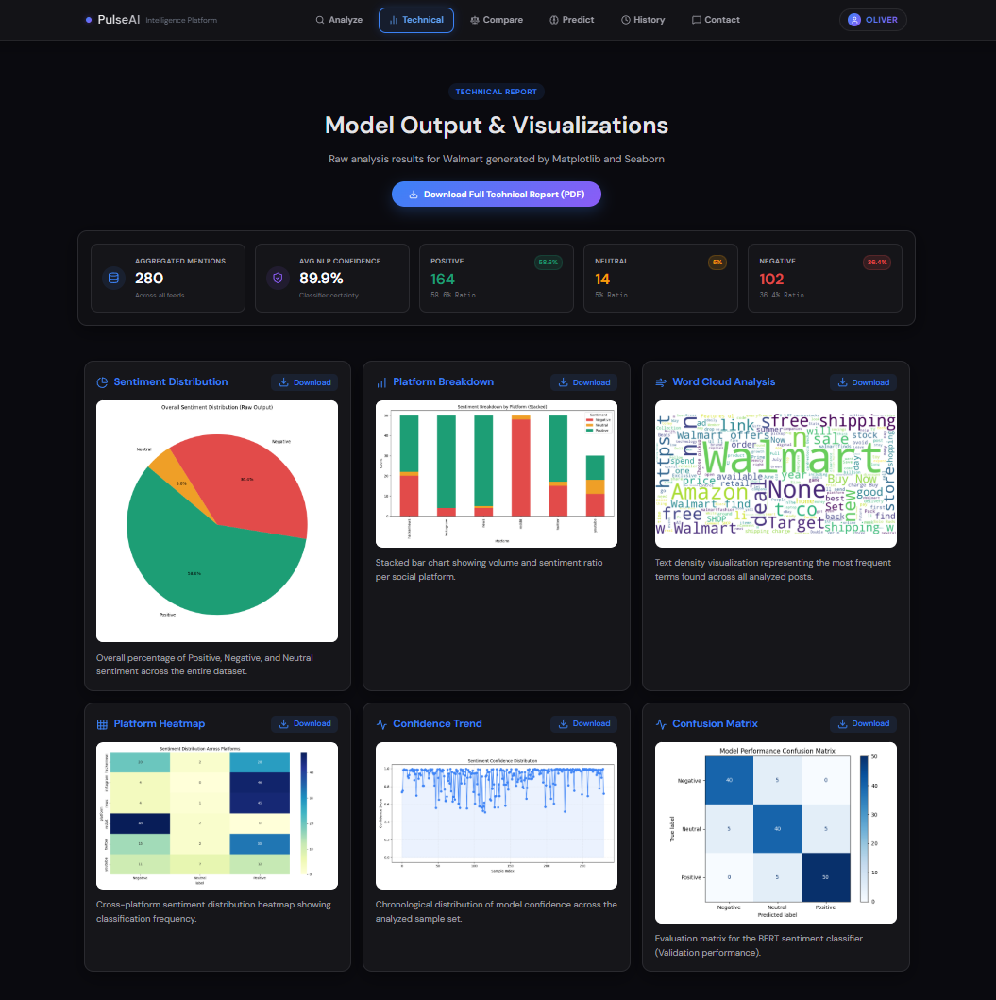
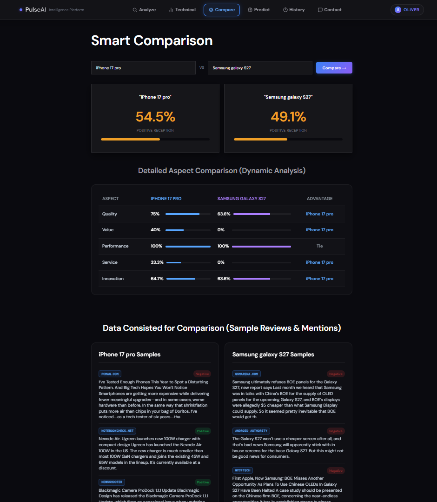
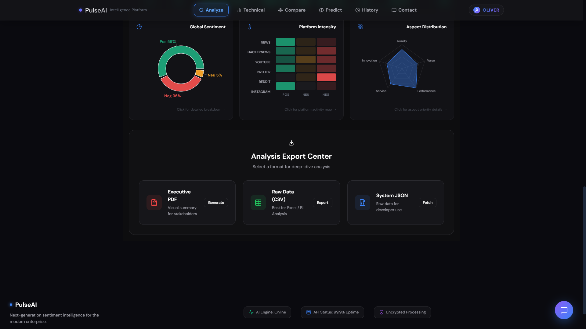
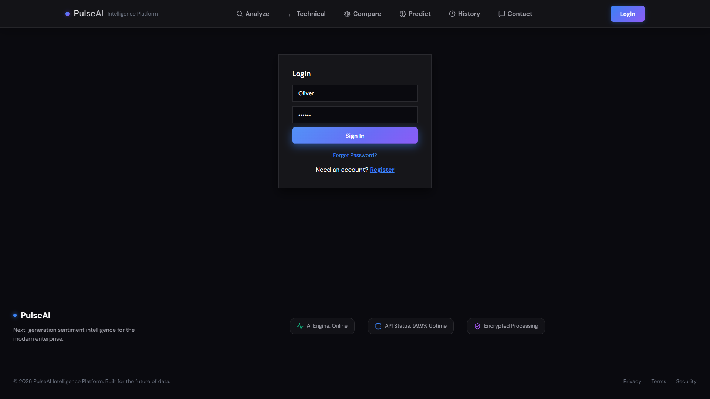
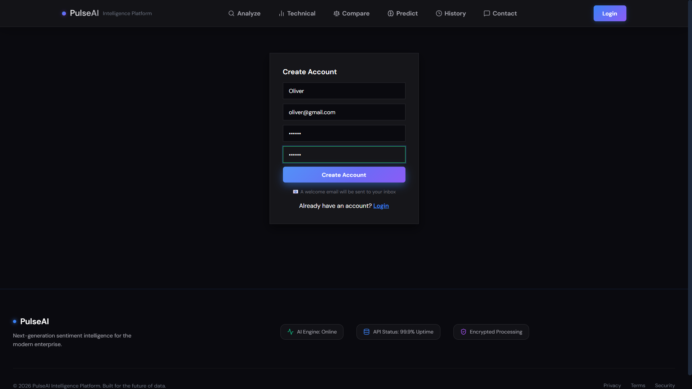
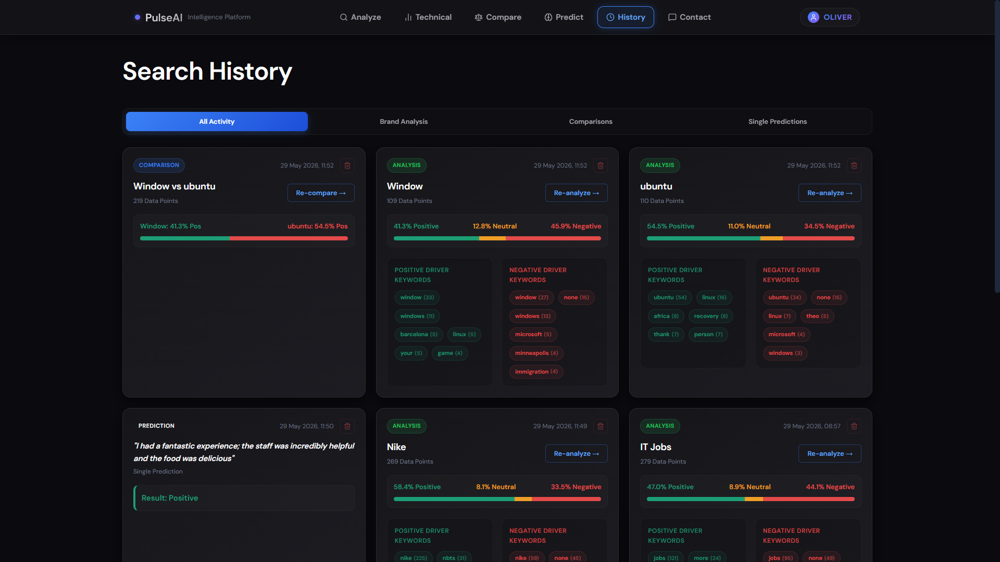

# PulseAI

**PulseAi** PulseAI is a full-stack AI-powered web application for real-time social media sentiment analysis. It collects data from multiple online platforms, analyzes sentiment using a fine-tuned RoBERTa model, and presents insights through interactive dashboards, comparative analytics, and downloadable PDF reports

---

## 1. Features

1. **Real-Time Sentiment Analysis**
   - Analyze products, brands, or topics using a fine-tuned RoBERTa model.
   - Classifies sentiment as Positive, Neutral, or Negative with confidence scores.

2. **Multi-Platform Data Collection**
   - Collects data from Twitter/X, Reddit, YouTube, Hacker News, and NewsAPI.
   - Aggregates content from multiple sources for comprehensive analysis.
  
3. **Comparative Analysis**
   - Compare sentiment between multiple products or topics.
   - View platform-wise sentiment distribution.

4. **Interactive Dashboard**
   - Visualize sentiment using charts and graphs.
   - Display keyword insights and sentiment trends.

5. **Report Generation**
   - Generate and download sentiment analysis reports in PDF format.
   - Maintain analysis history for future reference.

6. **Authentication & Security**
   - Secure user registration and login.
   - JWT-based authentication with protected routes.

---

## 2. Screenshots

 
 
 
 
 
 
 

 

---

## 3. Tech Stack

| Category             | Technology                                  |
| -------------------  | --------------------------------------------|
| **Frontend**         | React.js, Three.js, Recharts                |
| **Backend**          | FastAPI, Python, Axios                      |
| **AI / ML**          | Hugging Face Transformers, RoBERTa, PyTorch |
| **Database**         | PostgreSQL                                  |
| **Authentication**   | JWT                                         |
| **Report Generation**| ReportLab                                   |
| **Version Control**  | Git & GitHub                                |

---

## 4. Installation and Setup

### Prerequisites

- Python 3.10+
- Node.js 18+
- PostgreSQL

## 5. Steps to Run Locally

1. **Backend Setup**

   ```bash
   git clone https://github.com/TabassumSK/PulseAI.git
   cd PulseAI/pulseai-backend
   pip install -r requirements.txt
   uvicorn main:app --reload

   ```

2. Frontend Setup

   ```bash
   cd ../pulseai-frontend
   npm install
   npm run dev

   ```

---

## 6. Configure Environment Variables:

Create a `.env` file inside the backend directory.

```env
# Database
DATABASE_URL=your_postgresql_connection_string

# JWT
SECRET_KEY=your_secret_key
ALGORITHM=HS256
ACCESS_TOKEN_EXPIRE_MINUTES=30

# API Keys
NEWS_API_KEY=your_newsapi_key
YOUTUBE_API_KEY=your_youtube_api_key
XPOZ_API_KEY=your_xpoz_api_key
```

## 7. Analyze Xquik exports

Use the backend `/xquik/analyze` endpoint when you already have tweet rows from
Xquik and want PulseAI to score them with the same sentiment, keyword, aspect,
and visualization pipeline used by `/analyze`.

```bash
curl -X POST http://localhost:8000/xquik/analyze \
  -H "Content-Type: application/json" \
  -d '{
    "query": "brand launch",
    "posts": [
      {
        "tweet_id": "123",
        "tweetText": "Customers loved the launch",
        "created_at": "2026-07-01T12:00:00Z",
        "like_count": 42
      }
    ]
  }'
```

The import accepts up to 500 posts, skips rows without usable text, and returns
`skipped_count` plus `row_limit` so dashboards can show clear import feedback.
